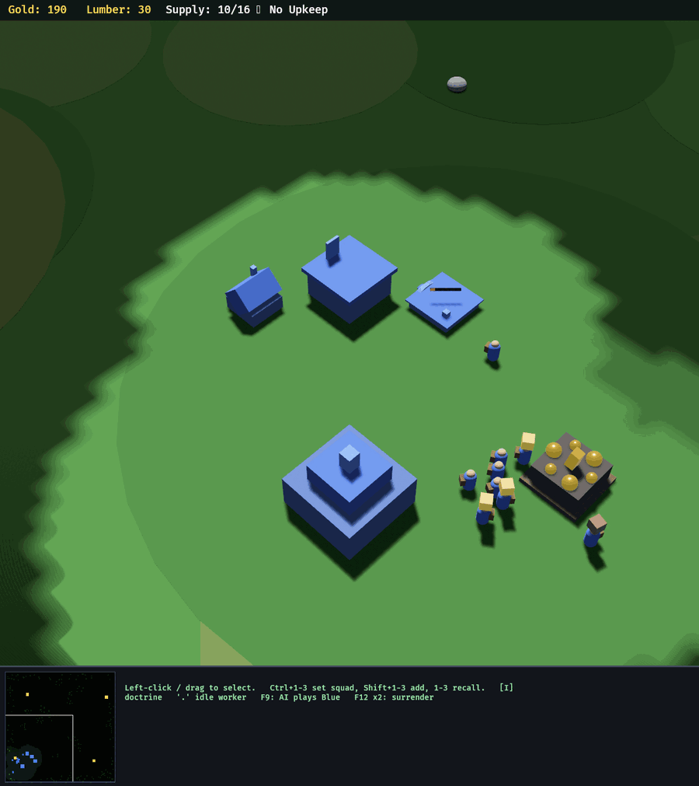

# The Arena Ledger

*Dogfooding as data. A round is a hypothesis test, and this is the file it goes in.*

## Why this exists

For ten rounds, the series lived in prose: a memory file, sixteen after-action
reports, a paragraph in `THESIS.md`, and eight beads. That prose is doing real
work — THESIS.md's fifth principle is that *the players are the playtest lab*,
and the reports are the lab notebook. But prose is a terrible place to keep an
experiment, because narrative reliably drops the one thing an experiment is
made of: **the question that was asked before the match started.**

"Round 9 ended at 5:24" survives retelling. "Round 9 was run to find out whether
3500-gold mines still leave room for tier 2 to exist" does not — and without it,
round 10 is just another match instead of *the answer to round 9*. The change
between them (`MINE_GOLD` 3500 → 5000, commit `c8be188`) was a hypothesis being
tested, and the only reason anyone can still say so is that someone happened to
write it in a commit message.

So the ledger's unit is not a match. It is a hypothesis test.

## The grammar of a round

Every record answers six questions, in this order:

| Field | The question it answers |
|---|---|
| `ruleset` | **Under what rules?** Map, environment, the balance constants at play, the commit. |
| `seats` | **Who was playing?** Which side, which team, scripted or commander, and which creed. |
| `hypothesis` | **What did we want to find out?** Written before the match. |
| `result` | **What happened?** Winner, length, and which of the engine's endings it was. |
| `evidence` | **How do we know?** AARs, logs, final snapshots, screenshots, metrics, sources. |
| `verdicts` | **What are we now entitled to believe?** Claims, each confirmed, refuted, or unresolved. |
| `lessons` | **What did it teach?** The sentences worth carrying into the next round. |

`hypothesis` and `verdicts` are the two fields that make a round evidence rather
than an anecdote. They are also the two a match cannot produce on its own: the
engine knows who won, and only a person knows what the win meant.

The distinction between `result` and `verdicts` is deliberate and load-bearing.
Round 6 was **won** by the rusher and **proved** nothing, because the loser
conceded on the owner's instruction while its position was winning. A schema
where the result implies the verdict cannot record that round honestly — and a
series that cannot record its own asterisks will eventually quote itself as
evidence for something it never showed.

## The honesty rule

Rounds 1–10 were played before this file existed. They are backfilled from
AARs, commit messages, source comments and the project memory file, and some of
their fields are simply **not recoverable**:

- Round 2 never produced a verdict at all — the simulator stopped feeding the
  bridge at t=3656 with `game_over` still null. Its length is genuinely unknown;
  three different clocks in the two reports disagree.
- `game_over_reason` did not exist in the engine until *after* round 10 (it was
  added because round 9's winner could not tell which victory it had got — see
  `shared.rs`, `GameOverReason`). Round 9's ending is therefore recorded as
  `null`, which is the honest answer and also the finding.
- No round has a recorded RNG seed, because there is no seed to record: the
  world seed is the compile-time constant `MAP_SEED` in `terrain.rs`.

A backfill that guessed at those would be worse than no backfill, because
nobody downstream could tell reconstructed numbers from recorded ones. So:

> **A missing value is `null`, never an invented one, and every `null` in a
> record must be named in that record's `unknown` list.**

This is checked, in both directions. `tools/arena.py validate` fails a record
with an undeclared `null`, *and* fails one that declares something which isn't
actually missing. The `unknown` list is a claim about the limits of our
knowledge, and it is the only claim in the file the tooling can verify on its
own.

`provenance` says which kind of record you are reading:

- `recorded` — a tool watched this match end and wrote down what it saw.
- `backfilled` — reconstructed from prose. `evidence.sources` says from what.

Rounds 1–10 are all `backfilled`. Round 11 onward, run through
`tools/arena_run.py`, are `recorded`.

## The schema

One JSON object per line in `arena/ledger.jsonl`, keys in schema order so a git
diff shows what changed about a round rather than that a dict reordered itself.

```jsonc
{
  "id": "r10",                    // r<number>, unique
  "date": "2026-08-10",           // YYYY-MM-DD
  "kind": "commander",            // commander | scripted | mixed
  "provenance": "backfilled",     // recorded | backfilled
  "ruleset": {
    "map": "crossings",           // open | crossings
    "env": {"WC3_BRIDGE": "both", "WC3_MAP": "crossings"},
    "constants": {"mine_gold": 5000},
    "commit": "c8be188",
    "notes": "One lever changed from r9: MINE_GOLD 3500->5000."
  },
  "seats": [
    {"seat": "bridge/red",  "team": "Claude", "kind": "commander",
     "persona": "rusher", "model": "opus"}
  ],
  "hypothesis": "Does the rusher line still win with 40% more gold in the ground?",
  "result": {
    "winner": "Claude",           // Claude | Human | null (a draw is an absent winner)
    "winner_persona": "rusher",
    "duration_s": 561,            // game seconds, not wall seconds
    "game_over_reason": "surrender",  // razed | surrender | score | none | null
    "decisive": true,
    "duration_approx": false,     // optional; true when the number came from prose
    "duration_note": "..."        // optional; when the sources disagree, say so
  },
  "evidence": {
    "aars":    [{"seat": "bridge/red", "path": "arena/r10/red-aar.md"}],
    "logs":    ["arena/r10/engine.log"],
    "shots":   ["arena/r10/shots/wc3-1754870400-t0324-01.png"],
    "sources": ["commit c8be188", "bead wc3clone-2hs"],
    "metrics": {"red_gold_final": 1539}
  },
  "verdicts": [
    {"claim": "More gold gets commanders to T3", "status": "refuted",
     "note": "Lumber, not gold, was the cap all game."}
  ],
  "lessons": ["Lumber, not gold, is what actually gates tier 3."],
  "unknown": []                   // every null path in this record, and nothing else
}
```

### Notes on the vocabulary

- **`razed` and `surrender` are the engine's own two endings** (`shared.rs`,
  `GameOverReason`). **`score`** is the headless time-cap verdict — a referee's
  opinion, not a win the game recognises, named differently so it can never be
  quoted as one. **`none`** is a round that stopped without ending.
- **A draw is an absent winner**, not a sentinel team. Round 2 is the reason.
- **`duration_s` is game seconds.** Wall time is a property of the hardware and
  `WC3_SPEED`; every AAR in the series is written in game seconds.
- **`persona` on a scripted seat is the literal string `scripted`.** "This seat
  had no creed" and "we don't know what creed this seat had" are different
  facts, and only the second one is a `null`.
- **`constants` is for balance values that were in force but are not in `env`.**
  `MINE_GOLD` is a compile-time constant, so the only way a round can say which
  value it was played under is to write it down.

## Using it

```bash
tools/arena.py series                     # the standings, the round table, pacing
tools/arena.py show r9                     # one round in full
tools/arena.py rounds --hypothesis mine    # every round that tested the economy clock
tools/arena.py rounds --persona boomer --winner Human
tools/arena.py lessons --grep tower        # what the players actually learned
tools/arena.py validate                    # schema + honesty check
tools/arena.py add-aar r11 --seat bridge/red --path arena/r11/red-aar.md
```

`series` is the query the AARs used to end on by hand:

```
10 rounds — rusher 6, boomer 3, 1 draw(s)
length: median 13:00, shortest 5:24, longest 64:43 (9/10 rounds timed)
provenance: 0 recorded, 10 backfilled
```

## Running a round

`tools/arena_run.py` owns the mechanical half of a round — the half that
rounds 9 and 10 did by hand, and that is therefore the half most likely to be
recorded wrong.

```bash
# scripted vs scripted, headless, appended to the ledger when it ends
tools/arena_run.py --hypothesis "does the tier ladder change scripted pacing?" \
    --seat red=scripted --seat blue=scripted \
    --map crossings --speed 16 --cap 1800

# a commander round: prepare the seats, then the orchestrator spawns the agents
tools/arena_run.py --hypothesis "does the rush still win at 5000g?" \
    --seat red=commander:rusher --seat blue=commander:boomer \
    --map crossings --windowed --cap 3000
```

It derives `WC3_BRIDGE` and `WC3_AI_BOTH` from the seats rather than trusting a
hand-typed value — they are two spellings of one fact (who is playing which
side), and a launch line where they disagree produces a match that isn't the
one anybody meant. It waits for a real game over, reads the duration and ending
out of the engine's own log, and appends a validated record.

**It does not spawn commanders.** An LLM seat is an agent with a persona, a
budget and a transcript; deciding one exists is the orchestrator's job. For
commander seats the runner prepares the seat directory, prints the briefing each
seat needs, and waits while the orchestrator spawns agents against those
directories. After-action reports do not exist when the match ends either, so
they are attached afterwards with `arena.py add-aar`.

### Safety

The bridge is a live singleton: one directory per seat, overwritten in place. An
agent once destroyed a real match by running a verification against a seat
somebody was playing. Two rules follow, enforced rather than documented:

- **If any engine process is already running, the runner refuses to start.** It
  does not ask and it does not kill anything. The check matches the *executable*,
  not a command line mentioning it — a `pgrep -f target/debug/wc3clone` would
  match the runner's own argv and refuse every run.
- **It never deletes a bridge directory.** Directories it creates are its own;
  an existing one is reused only with `--reuse-seat`, and a pre-existing
  snapshot is *renamed aside*, never removed — a stale `game_over` from the last
  match would otherwise read as this match ending instantly.

## Screenshots

`F10` writes a PNG of the window to `shots/`, or to `$WC3_SHOT_DIR` — which the
runner points at `arena/<round>/shots/`, so a screenshot files itself with the
round it belongs to. Names carry both clocks: `wc3-<unix>-t<game seconds>-<n>.png`.

This exists because external capture does not work here. Three agents in a row
photographed the game with an outside tool and filed a **stale pixmap** as
evidence: under XWayland the X11 window contents are not what is on the screen,
so the shot showed a frame from minutes earlier — and nobody could tell, because
a stale frame of an RTS looks exactly like a fresh one. The only process that
reliably knows what a frame looks like is the one that drew it, so the engine
takes its own pictures.

Headless runs have no key to press and no renderer to ask, and simply never do
this. That is the graceful no-op: not a branch, an absence — the hotkey is
registered by `UiPlugin`, which `main.rs` adds only when there is a window.



*Taken by pressing F10 during a windowed AI-vs-AI run, 45 game-seconds in:
`wc3-1786388320-t0045-02.png`. The point of the picture is that it is the frame
that was actually on the screen — HUD, fog boundary, workers on the mine, all
consistent with t=45 — which is exactly what the external tools failed to
deliver.*

## What the backfill could not recover

Recorded here so the gaps are a known quantity rather than a surprise:

- **Round 2's length and verdict.** No `game_over` was ever set; the two reports
  cite three different clocks (t≈2600, t≈2915, t≈3656).
- **Round 9's `game_over_reason`.** The field did not exist. The winner's own
  report says it could not tell whether it had razed the enemy or been conceded
  to — which is precisely why the field exists now.
- **Round 8's exact length.** The loser reports surrendering at t≈3700; the
  referee and the winner record a raze at t≈3883. The raze is the engine's own
  ending, so it is the one recorded, with the disagreement in `duration_note`.
- **Rounds 3, 5, 8 lengths are prose-rounded** ("game-minute 13", "t≈1167") and
  carry `duration_approx: true`.
- **Launch environments for rounds 1–8.** Only `WC3_BRIDGE=both` is attested.
  The map is inferable — `crossings` did not exist until commit `62d81b0` — so
  rounds 1–8 are recorded as `open`.
- **AAR files for rounds 1–8.** They exist only inside subagent transcripts, not
  as files. Rounds 9 and 10's reports are in the repo at `arena/r9/` and
  `arena/r10/`; earlier rounds cite their transcripts in `evidence.sources` and
  carry their substance in `lessons` and `verdicts`.
- **Per-round seeds.** There are none to recover: `MAP_SEED` is a compile-time
  constant and the world is identical every run.
