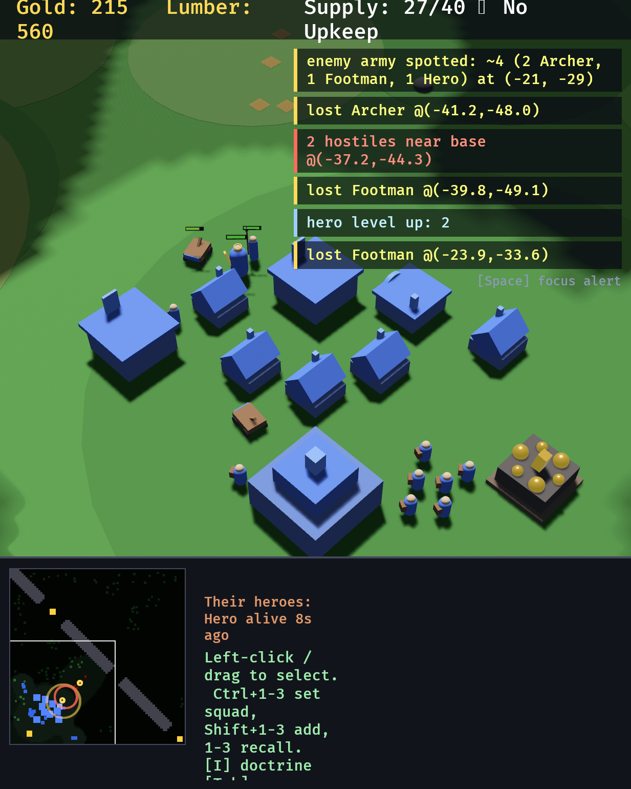
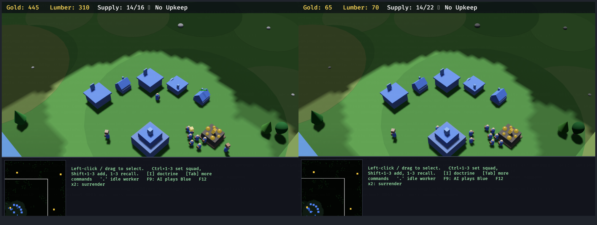

# Fog of War

*One rule of knowability: computed once, rendered twice.*

This is the third of the asymmetries named in [THESIS.md](../THESIS.md). Tempo was
answered by the doctrine layer; interface by the shared vocabulary; information was
answered halfway — the event feed became a shared artifact, but the *snapshot* still
handed a commander the whole board while the player at the keyboard got one screenful,
and the scripted AI read enemy positions straight out of the ECS.

Three different notions of "what is knowable" for one game. This document describes the
one that replaced them.

*The player's renderer, early in a match: a lit disc of current vision around the base, a
dimmer ring of explored ground, black where nothing has ever been. On the minimap, the
same grid — with gold mines and the camera viewport drawn deliberately above the fog,
because both are public. No enemy is anywhere on screen.*

## The rule

`shared.rs` computes **one `FogGrid` per team** at ~4 Hz and every other module only
*reads* it. There is no second implementation anywhere, and that is the entire design:
a rule with two implementations is two rules, and two rules is an information advantage
for whoever happens to have the better one.

| Consumer | What it does with the grid |
|---|---|
| `bridge.rs` | filters each seat's `state.json` through that seat's team's grid |
| `ui.rs` | paints the same grid as a terrain overlay + minimap fog, **tints the scenery standing on it**, and hides the same entities the snapshot omits |
| `ai.rs` | takes every enemy fact through it before planning |
| `doctrine.rs` | Forage targeting and Defend threat response go through it |
| `shared.rs` (event feed) | filters the two event categories that are not own-team knowledge |

Because the snapshot and the screen are filtered by the same array, **snapshot content ==
renderable content** is a property of the code rather than a promise in a comment.

### Three states

Classic two-level fog, on the **`NavGrid`'s own cell geometry** (100×100 cells of 2.0
world units) — fog reuses the nav grid rather than inventing a second one, so "the cell a
unit stands in" means one thing in this codebase.

| State | Meaning | Terrain | Enemy units | Enemy buildings |
|---|---|---|---|---|
| `Unexplored` | never seen by this team | hidden | hidden | hidden |
| `Explored` | seen before, not now | remembered | **hidden** | remembered as ghosts |
| `Visible` | in sight of a living unit or building, right now | shown | shown | shown live |

Units are deliberately **not** remembered *in this table*. An army is not furniture, and a
commander acting on a stale unit position **reported as a current one** has been deceived
by its own interface. Buildings are remembered because they do not move.

That was for a long time the whole argument, and it was half of one. See **[Intel](#intel--sightings-as-durable-queryable-knowledge)**:
the observation is now kept, in a separate ledger where every record wears its own age and
nothing in it can be misread as a live contact.

### Vision is radial, and terrain does not block it

The game has no elevation model — the `crossings` canyon is a nav barrier, not a cliff —
so a line-of-sight pass would cost more than the whole rest of the fog system for a
fidelity nobody can act on. Both teams get the same simple rule.

Every fog query is **XZ only**, so altitude never changes what a unit sees. A flyer
lights exactly the cells it would light standing on them.

## Vision radii

Sight lives in the stat tables next to everything else, is **exported in the catalog**
(`units[].vision`, `buildings[].vision`), and is therefore discoverable by both players
the same way — the human reads it off the build menu's data, a commander reads it out of
`catalog.json`.

Vision is deliberately independent of attack `range`: what a unit can shoot and what it
can find are different questions, and the gap between them is where scouting lives.

| Unit | Vision | Attack range | Note |
|---|---:|---:|---|
| Worker | 12 | 1.8 | not a scout |
| Footman | 16 | 2.0 | the baseline |
| Archer | 18 | 14 | sees a little past its own reach |
| Spearman | 18 | 2.6 | a picket must see the riders coming — but still short of the Raider's 24, so cavalry keeps the initiative |
| Catapult | 14 | 20 | **sees less than it shoots** — siege needs spotters |
| Raider | 24 | 2.2 | **the scout**: sees far, can barely hit anything |
| Sorcerer | 18 | 11 | a caster whose spell is an 8-unit bubble around itself must see the charge coming from further out than it can throw it |
| Knight | 20 | 2.4 | shock cavalry closing at 9.5 has to see the shape it is about to hit — so it out-sees the 18 of the spear picket that counters it, but stays short of the Raider's 24: the hammer, not the scout |
| **Gryphon Rider** | **26** | 6 | **the widest eye in the game**, equal to a TownHall's — altitude is an observation post, fog is XZ only, so height costs a flyer nothing and buys it reach. A hall's worth of vision that *moves*, and Castle-gated because sight this good has to arrive late |
| Hero (Champion) | 20 | 2.4 | leaders see |
| Priestess | 18 | 10 | |

| Building | Vision | Note |
|---|---:|---|
| **Castle** | **34** | top of the ladder: the hall alone watches the approach a Tower would |
| **Keep** | **30** | |
| TownHall | 26 | a base is a team's permanent eyes |
| Tower | 20 | exceeds its 16 attack range — never shoots at what the team cannot see |
| Barracks | 18 | |
| Arcane Sanctum | 18 | level with the Barracks — the caster's drill yard, not a watchtower |
| Workshop | 16 | |
| Blacksmith | 14 | a forge looks at its own anvil |
| Shop | 14 | |
| Farm | 12 | |
| Wall | 8 | |

Vision climbs the **TownHall → Keep → Castle** ladder for the same reason HP does: what an
upgrade buys is a taller fortification, so each rung watches a little further over its own
ground. It is a real if modest reward, and it is asserted monotonic by
`upgrade_only_kinds_are_never_placeable_and_never_shrink_the_building` alongside the
existing hp/size/supply invariants — a tier-up must never *narrow* what a hall sees, or
teching up would blind you in your own base and the fog would punish the reward.

Nothing in the fog code special-cases `BuildingKind::TownHall`; radius comes from the
per-kind table, so `is_hall` never needed to appear here and a fourth rung would work with
no edit. `Building.kind` mutates in place when a hall tiers up, and vision is read from the
live kind every tick rather than cached at spawn, so the new radius applies the moment the
conversion lands. Buildings mid-`Upgrading` are seen, hidden and remembered like any
other: they keep `Building`/`Team`/`Transform`, and only their `scale.y` is animated.

Buildings provide vision **while under construction** too: a builder standing on a
foundation is looking around.

Two of these numbers are load-bearing balance choices rather than flavour. The Catapult
seeing less than it shoots makes an unescorted siege line genuinely blind, which is what
gives its escorts a job beyond soaking damage. The Raider's 24 makes cavalry the cheapest
answer to "where are they?", which is a role it did not previously have.

## Memory model

Per team, the grid keeps a record of **every enemy structure ever observed**, refreshed
every tick it is in sight — which is what makes the memory current the moment sight is
lost. A record holds `kind`, `pos`, `hp`, `max_hp`, `done` and `last_seen` (game time).

A ghost is forgotten **only when the team can see that the thing is gone**. Walk back onto
the rubble and the memory clears; stay away and you go on believing the barracks is still
standing. That is precisely the mistake fog of war exists to let you make — a ghost can be
stale, and it is the correct amount of wrong.

A ghost is **honestly stale about tier, too**. A scouted TownHall that upgrades to a Keep
with nobody watching keeps reporting *TownHall* — the rung the scout actually saw, not the
one it has no way to know about — and `buildings[].tier` on that record is derived from the
remembered kind. Every rung shares an 8.0 footprint, so a ghost drawn from the stale kind
is still the right size on screen. `upgrading` is never set on a ghost: a conversion is a
live thing, and a stale progress bar would be invented intelligence rather than preserved
intelligence. Covered by `a_hall_that_tiers_up_behind_the_fog_keeps_its_stale_ghost`.

`FogGrid::ghosts()` yields only records whose cell is **not currently visible**. The
backing map holds everything ever seen, including things visible right now; without that
filter every renderer would draw a scouted base twice — once live, once as its own ghost.
"Ghost" means *memory standing in for sight*, so sight wins.

## Intel — sightings as durable, queryable knowledge

*The memory model above stops at structures. This is the half it was missing.*

*The same one rule, in three of its renderings at once. On the ground at the top left, three
**amber tiles** where enemy units were last seen — flat marks on the earth, deliberately not
the standing translucent boxes a remembered building wears, and the one furthest into the
fog is dimmer because it is older. In the alert stack, the feed's aggregate line: `enemy
army spotted: ~4 (2 Archer, 1 Footman, 1 Hero) at (-21, -29)`. Bottom right, the HUD's
`Their heroes: Hero alive 8s ago` — a belief with its age attached, never a level. And on
the minimap, the same sightings as 2px dots, smaller and darker than a live contact's. A
bridge commander reading `intel` at this instant receives exactly these facts and no
others.*

"A remembered army is a lie" was the right instinct pointed at the wrong thing. A player
who watches six footmen cross the centre ford does not forget it a quarter of a second
later; they remember a stale fact **as** a stale fact and discount it, and that discount is
most of what scouting skill *is*. The lie was never the memory. It was reporting a memory
in the same shape as a sighting, so that nothing downstream could tell them apart.

So `units[]` is untouched — it still reports only what is visible this instant — and the
observation is kept in a **separate ledger** with a timestamp welded to every entry. The
two cannot be confused, structurally rather than by convention: `units[]` records have no
`t_seen` and every intel record has nothing else.

The ledger lives in `FogGrid` beside `ghosts`, is written by `update_fog` in the same pass,
off the same cells, at the same 4 Hz. **The only line that inserts a sighting is guarded by
the identical `vis_at(..).sees()` the building ghosts are guarded by**, so fog-honesty is
inherited rather than re-derived — a unit that has never stood in a visible cell cannot
appear, and there is no second code path that could put it there.

### What a sighting stores, and why exactly that

| field | how a human knows it |
|---|---|
| `kind` | the model is on screen |
| `pos` | it is standing there |
| `hp_frac` | health bars are children of their owner, so an enemy that renders renders its bar |
| `heading` | they watched it move, across two consecutive fog ticks |
| `t_seen` | the clock |

Deliberately **absent**: level, xp, mana, inventory, squad, orders, abilities. The test is
not "is this about the enemy" but "**could a human have obtained it**", and the answer here
is settled by one fact about the interface: `ui.rs`'s pickers are own-team only — both the
rubber-band and the plain click `continue` on `*team != Team::Human`. No enemy is ever
loaded into the panel that prints `Lv 4`, so no human has ever read an enemy hero's level
off a screen, so no commander gets one. A field the wire had and the keyboard could not
obtain would be the asymmetry this document exists to close, running backwards.

`heading` is a coarse 8-point compass reading (`N` is `+Z`, matching the minimap's up) and
it is `None` more often than not, honestly: a unit standing still has no heading, and a
**first glimpse** has none either, because a heading is a difference between two
observations. Re-acquiring the same raider a minute later on the far side of the map also
yields `None` — the straight line between two distant observations is a line nobody watched
it travel.

### Expiry: the one place unit memory differs from building memory

Three ways out of the ledger, and the differences from `ghosts` are all downstream of the
fact that units move.

1. **The rumour horizon.** A sighting unrefreshed for `SIGHTING_TTL_S` (**90 game-seconds**)
   is dropped. Buildings are remembered forever because they do not move; a unit's position
   decays into fiction at walking pace, and 90s is about the time an army needs to cross
   this map twice. Past that the record has no remaining power to say where anything *is*,
   only that it existed and once passed through — so it is a rumour, and the ledger does
   not keep rumours.
2. **Watched dying.** If the unit stood in our vision at the **previous** recompute and is
   absent from the world at this one, we saw it die and the record goes at once.
3. There is deliberately **no** "we looked and the spot was empty" removal — which *is* the
   building rule. A ghost claims the barracks is standing there, so walking onto the rubble
   refutes it. A sighting claims only that a unit was there **at `t_seen`**, and walking
   onto the spot refutes nothing the timestamp had not already said. Watching an army march
   off is not amnesia: the marker stays where you last saw it, wearing the heading you
   watched it leave on, which is the fact worth keeping.

Rule 2 is stricter than the ghost rule on purpose, and the difference is a real
fog-honesty bug avoided. The ghost test — *gone, and we can see the spot it was* — is
**wrong for something that moves**: a hero that walked out of our sight and died half a map
away would be reported as watched-dying by a scout still staring at the empty grass it
left, which is intelligence nobody observed. Requiring that it was visible *one tick ago*
closes it, because a quarter of a second is not enough to leave our vision **and** die
somewhere we cannot see. Entities are despawned centrally by `apply_death` and by nothing
else, so "absent from the world" means dead rather than bookkeeping.
`a_unit_that_leaves_our_sight_and_dies_elsewhere_is_not_seen_dying` fails if this weakens.

### Armies: the aggregate is computed where it is read

The ledger's grain is wrong for the question people actually ask. Nobody wants eleven rows;
they want *there is an army of eleven at the ford*. `FogGrid::army_groups()` clusters
sightings by **single-link agglomeration** — two join a group when they are within
`GROUP_RADIUS` (18) of each other **and** were observed within `GROUP_WINDOW_S` (10s) of
each other.

Both halves are load-bearing. Without the distance test the whole map is one army. Without
the **time** test a footman glimpsed at the ford eighty seconds ago merges with an archer
standing there now, and the ledger reports a two-unit force that existed at no instant — an
aggregate that is a lie assembled out of two honest facts, which is the failure this whole
section is arranged against.

Clustering happens **where it is read** rather than being stored, so there is one truth and
every summary is derived from the current one. It is O(n²) over a bounded ledger and
deliberately not clever. Workers are excluded: a mining crew is not an army, and
`enemy_army_seen` firing on one would be the same false alarm `base_under_attack` refuses to
raise for a skirmish in midfield. They stay *in the ledger* — five workers on a hillside is
exactly how you find an expansion — they just do not constitute a force.

### Heroes: belief, not bookkeeping

Per enemy hero **class** (not entity — a class is what survives a death, and heroes revive
through `HeroRecords`), one of three states, and there is no fourth because there is no
fourth thing an observer can honestly be in:

| status | means |
|---|---|
| `unknown` | never laid eyes on it. **Not** "they have no hero" — those are the same empty observation, and conflating them is the mistake the `fog` block prevents for terrain |
| `alive` | seen alive, nothing since says otherwise. Read it as *alive as far as you know*: it may have died two minutes ago somewhere nobody was looking, and this will go on saying `alive`. That is not a bug in the belief, it is the belief |
| `seen-dying` | we **watched it die**. Witnessed, not inferred from an absence |

The belief is **revocable**: see the hero alive again after a revive and the status returns
to `alive`. A latched "dead forever" would be the interface lying on the enemy's behalf.

### Rendered twice, as everything here is

| renderer | what it does with the ledger |
|---|---|
| `bridge.rs` | the top-level `intel: {sightings, groups, heroes, ttl_s}` block, own-seat |
| `ui.rs` (world) | `sync_intel_markers` — pooled amber tiles on the ground where units were last seen, in four pre-built age fades |
| `ui.rs` (minimap) | 2px darkened dots, smaller than a live contact's 3px and a structure's 6px |
| `ui.rs` (HUD) | `enemy_hero_line` — the `Their heroes:` line, from the same `hero_intel()` the snapshot serialises |
| `shared.rs` (event feed) | `enemy army spotted: ~8 (5 Footman, 3 Archer) near the center ford` |

The world markers are a **flat tile**, not a standing box, precisely because a ghost means
*there is a barracks there* and a tile means *something stood here once*. Both are
suppressed over currently-visible ground, on the rule `FogGrid::ghosts()` already applies:
sight beats memory. Age fading uses **four pre-built material handles swapped by the
frame**, never one material repainted — that is the `FogTinted` discipline, designing out
the bind-group staleness trap documented under `update_fog_overlay` rather than defending
against it.

The event line is rate-limited **by place rather than by group identity**, and that is the
only way it could work: a group has no stable id — it is re-clustered from scratch every
time anyone asks, and one casualty renumbers it — so suppressing by identity would suppress
nothing. What a reader means by "I already know about that army" is "I already know about an
army *there*", and ground holds still. A group must also have been observed within
`ARMY_EVENT_FRESH_S` to be *spotted* rather than merely remembered, or a ninety-second-old
rumour would be announced as news the moment its patch of ground came off cooldown.

### What the ledger unlocks

Two `TriggerWhen` arms, and they are the only two predicates in the language that read
memory rather than the world — which means they inherit fog-honesty from the ledger instead
of re-deriving it. Neither arm touches `world.units` at all, which is the structural version
of that claim.

- **`enemy_army_seen {size, within_s?}`** — differs from `enemy_sighted` exactly by memory.
  `enemy_sighted` is true only while eyes are on them, so it goes false the moment your
  scout dies, which is what the scout was killed for. This one stays true. `within_s` is how
  a commander asks for a *current* army rather than a *known* one. It carries no region:
  regions are a different vocabulary and a predicate that grew its own notion of "where"
  would be the second implementation this project keeps refusing to write.
- **`enemy_hero_down {class?}`** — a **level** predicate, "as far as we know their hero is
  down", not an edge on a death event. Armed `once` it fires on the first sweep after the
  belief takes hold and disarms, which is the edge behaviour "when their hero falls" means —
  obtained without an edge-detection latch nobody can inspect. Armed repeating it re-fires
  while the belief stands, which reads as "keep pressing while they have no hero" and is why
  the level form was kept rather than special-cased.

And it kills a deferral that had stood since the compiler shipped. `tools/intent_compile.py`
now compiles **"strike when their hero falls"** for real. What it still refuses is the
neighbouring sentence, *"strike when their hero is below 30%"* — and keeping those apart is
the point. Enemy hero **health** is unknowable (you cannot select one); enemy hero **death**
is the most public thing that can happen on a battlefield. Not *is this about the enemy*,
but *could a human have seen it*.

Under `BH_FOG=0` the ledger stays **empty**, exactly as `ghosts` does and for the same
reason: `update_fog` returns before it writes anything, live sight supersedes memory
entirely, and an intel section would be a second staler copy of a board already fully
reported.

## What stays omniscient, and why

Fog models a commander's **attention**, not a unit's senses.

> The line is: *where a unit is sent* obeys fog; *what a unit does when something arrives
> in front of it* does not.

Gating the second kind would produce soldiers who stand still while being stabbed because
headquarters had not noticed yet.

**Engine-diegetic, deliberately NOT fog-gated** (all in `combat.rs`):

- target acquisition / aggro radius (`acquire_targets`)
- tower acquisition (`tower_acquire`)
- retaliation when damaged
- the `LeashPolicy` anchor check inside acquisition
- `doctrine.rs::auto_cast_abilities` — the caster's own eyes; a hero's 20 vision far
  exceeds the 7-unit Slam radius, so gating it would change nothing except add a lie
  about where the rule lives

**Map geography is public, and always was.** The `map` block (layout, summary,
chokepoints), gold mine positions *and their remaining gold*, and `trees_near` ship
unfiltered to both seats; `ui.rs` paints mines and the terrain barrier above the minimap's
fog layer for the same reason. Fog hides what the opponent is *doing*, not where the map's
furniture sits.

Mine `remaining` is the one deliberate concession and deserves naming as such: it is the
shared clock the whole economy is timed against (expansion windows, "mines run dry" from
the design principles), both `plan_expansion` and a human budget against it, and scouting
reveals it anyway. Hiding it would buy a little intel and cost the design principle it
serves.

**Scripted-AI remainder.** The conversion of `ai.rs` is complete for enemy state — all
four enemy buffers (`enemy_any`, `enemy_ground`, `enemy_combat`, `enemy_buildings`) now
flow through the team's grid, which covers threat assessment, worker flight, Slam timing,
wave target picking and the expansion danger checks. What remains omniscient there is
non-enemy information only: neutral `ResourceNode`s (public geography, above) and the
AI's own state. **There is no known omniscient enemy read left in `ai.rs`.**

## Consequences worth knowing

**Bounty caches are now vision-gated.** A cache is treasure on open ground, not geography,
and open ground nobody is looking at tells you nothing. This is a real gameplay change:
the `Forage` posture now chases only what its team can currently see, so Forage has become
a posture for an army already out on the map rather than a map-wide treasure radar. A
squad that can see no cache falls back to mustering (the existing Forage→Defend rewrite).

**The event feed was audited category by category.** Own losses, own buildings, own hero,
own squad wipes are own-team knowledge by construction and need no gate. Two categories
did leak:

- **"hostiles near base"** — `THREAT_RADIUS` is 45 world units, which is *wider than any
  vision radius in the table*. The tempting assumption that anything near your own base
  is inside your own vision by definition is false, and unfiltered this event was a free
  early-warning radar ringing the entire approach to your base. It now reports the
  hostiles you can actually see.
- **bounty spawn/disappearance** — announced only when the cache enters your vision, and
  "gone" only when you are watching the spot it vanished from. Leaving your vision is
  explicitly *not* a disappearance: the memo is a team's belief about the map, so a cache
  that walks out of sight stays believed-in, and one that expires unseen is dropped
  silently rather than reported as news you did not witness.

### A claimed cache is asymmetric on purpose

*`wc3clone-azo`, from a round-9 AAR.* The two bounty lines above are what a **watcher**
observes, and for a long time they were all anyone got — including the team standing on
the cache. That team saw `bounty gone @(x,z)`, exactly what a distant observer saw, and
then had to diff its own gold against harvest income arriving in the same second to work
out whether it had won the race or lost it. The one fact that settles it is the only fact
the diff structurally cannot produce: **who took it.** Nothing about two consecutive
pictures of the world says so, because bounty.rs despawns the cache on claim.

So the claim announces itself, out of band of the diff, through `GameEvents::push`:

| seat | what it is told |
|---|---|
| the team that claimed | `we claimed the cache (+270g)` — attributed, with the gold |
| the other team | `bounty gone @(x,z)` — and **only** if it was watching the spot |

**The asymmetry is the fog rule, not an exemption from it.** Who claimed a cache appears
in no snapshot and on no minimap: there is no observation an opponent could make that
would reveal it, so telling them would hand out intelligence the map does not contain.
What an opponent *can* observe is that treasure they were looking at is no longer there,
and that is precisely what they are told. An opponent who was not looking is told nothing
and goes on believing the cache is there, per the memo rule above.

The claiming team does **not** also get the anonymous `bounty gone` line for its own
cache — it has already been told, with more information. The claim's cache id rides on
`BountyClaim` for exactly this suppression, so the two producers cannot double-report.
This is the "one producer, two renderers" rule holding: still one event feed, still
pushed to the acting team only, still nobody writing to `team.enemy()`.

**Attack orders are gated both ways.** A `state.json` that will not show you an enemy must
not accept an `attack` command against it either, or the filtering is decoration. The
gate is `knows_entity` — visible now **or** a remembered structure — and `intent.rs`
applies it to whoever is speaking (`target N is not visible`).

`ui.rs`'s pickers apply the identical rule, in both of its halves. Enemy **units** are
gated on `sees`: they are never remembered, and a hover highlight over an invisible one
would be a perfect enemy detector — sweep the cursor across the fog and watch the
crosshair light up. Enemy **buildings** are clickable while visible *or* while the team
remembers them, because that is what the compiler accepts: the right-click picker and the
hover ring both read `FogGrid::ghosts()`, the very iterator that draws the ghost boxes, so
what can be clicked is what is on screen and the target id handed to `Intent::Attack` is
the `RememberedBuilding.id` a commander would type. Driving the ring off the *record*
rather than the live entity is deliberate — a ring that appeared only for buildings still
standing would answer "is it still there?", and only walking back over the rubble is
allowed to answer that. See docs/INTENT.md, "The residual asymmetry".

**The scripted AI needed a minimal explore behaviour.** Before fog, "attack the enemy
base" could never be wrong because the enemy base was always in the snapshot. Now an
opponent that loses its main and survives on an unscouted expansion is genuinely lost, and
an army that only ever walks to a place it has already confirmed is empty would never find
it — the match would run to the time cap with both sides intact. `wave_objective` picks,
in order:

1. the nearest **known** enemy structure (visible now, or remembered from a dead scout);
2. failing that, the opponent's **starting base**, as long as it has never been looked at
   — the one enemy position every player is born knowing, and walking there is both an
   attack and a scouting run;
3. failing that, the **nearest never-seen walkable cell**.

Clause 3 is what keeps the win condition reachable. It is not clever and is not meant to
be.

## Snapshot changes (`bridge.rs`)

| Field | Change |
|---|---|
| `units[]` | enemies only while **currently visible**; never remembered *here* — the memory is `intel` |
| `intel` | **new** object: `{sightings[], groups[], heroes{}, ttl_s}`. What this seat REMEMBERS of the enemy, every record stamped with `t_seen` and `age`. Always present, on the same reasoning as `fog` |
| `buildings[]` | enemies live while visible; otherwise appended as **remembered ghosts** |
| `buildings[].last_seen` | **new**, optional. Present *only* on ghosts — game time of the observation. Its presence is exactly the "this is memory, not observation" flag. Ghosts carry empty `queue`/`progress` and no `ability_cd`: a production queue is a live thing, and remembering one would be inventing intelligence rather than preserving it |
| `bounties[]` | only while visible — the two seats' lists now legitimately differ |
| `fog` | **new** object: `{enabled, explored, visible}`. Read it before concluding anything from an empty `units` array — "I have no information" and "there is nothing there" are otherwise the same empty list |
| `mines[]`, `trees_near`, `map` | **unchanged** — public geography |
| `me`, `squads`, `unlocked`, `events` | **unchanged** — own-team by construction |
| `events[]` bounty claims | `we claimed the cache (+Ng)` reaches the **claiming team only** — see "A claimed cache is asymmetric on purpose" |
| commands | `attack` against a target that is neither visible nor remembered is rejected |

`catalog.json` gains `vision` on every unit and building.

## The escape hatch

`BH_FOG=0` restores the pre-v2 omniscient baseline: every cell permanently `Visible`, no
memory, nothing filtered anywhere. It exists so old AARs and balance tooling have
something to compare against — **not as a gameplay option**. Default is on.

It is implemented as a *fully lit grid* rather than a flag checked at every call site, so
every reader works unchanged against it and the disabled path cannot drift from the
enabled one. The one place the flag itself is consulted is `ui.rs`, which takes the
overlay off the screen entirely rather than painting a transparent one every frame.

The mode is logged once at startup (`fog of war: ON (BH_FOG=0 to disable)`) so a log or
an after-action report always says which rules it was played under.

## Rendering notes and known limitations

The overlay is a **single quad** lying on the ground plane at `y = 0.16`, textured with a
100×100 image built straight from the grid — one texel per nav cell, linearly filtered so
the boundary is soft rather than a staircase. The **same image handle** is mounted on the
minimap as an `ImageNode` (with `flip_y`, since the minimap draws +Z upward while the
texture stores it downward), which is why the two views cannot drift apart.

One texture, two renderers — and they do **not** pick up a repaint the same
way. The UI resolves an `ImageNode`'s handle to its current `GpuImage` every
frame, so the minimap is correct for free. A mesh material does not: a
`StandardMaterial`'s bind group is built once and rebuilt only when the
*material* asset changes, so a quad whose texture is repainted every frame goes
on sampling the `GpuImage` that existed when its bind group was prepared.

That failure is worth naming because of how it presents. The ground keeps
wearing the **opening frame's** fog — a lit disc around the start base, and
nothing explored anywhere, because on frame one nothing *is* explored yet —
while the minimap tracks the match perfectly. Nothing errors, no state is
wrong, and the two renderings of the one grid silently disagree, which is the
single thing this document promises cannot happen. So `update_fog_overlay`
republishes the quad's material every time it repaints the texture, and
`repainting_the_fog_overlay_republishes_the_material_it_is_worn_by` fails if
that line is ever removed.

Consequences of it being a flat quad rather than a shader:

- **Enemy entities are hidden, not dimmed.** `Visibility::Hidden` on the root removes the
  whole entity, health bars included, since bars are children of their owner. This is the
  correct behaviour anyway — a dimmed enemy is still an enemy you can see.
- The overlay is removed from the screen entirely under `BH_FOG=0` rather than painted
  transparent every frame.

### Scenery obeys the fog — the third renderer

*The same camera, the same map seed, the same 800×600 window. **Left:** the flat quad
darkens the ground and nothing else, so four rocks standing in fogged terrain are lit as if
it were noon. **Right:** the same four rocks wear their cell's shade. Measured peak
luminance across those four doodads: **171.8 → 103.6**, and their contrast against the
fogged ground beside them falls from 3.16× to 1.91× — dimmed with the earth they stand on
rather than glowing out of it.*

The quad lies at `y = 0.16`, so it can darken nothing taller than 0.16, which is nothing.
A rock is half a unit across and a pine's canopy is four units up: both stood in full
daylight over black or half-black earth. The floor said *unexplored* and the forest on it
said *I am being watched right now*, and the eye believes the forest.

That used to be papered over — trees were hidden outright until their ground was
explored, and rocks were written off as carrying no information — but "carries no
information" was the wrong test. A field of lit pebbles floating on unexplored black is
the single most obvious way this fog looked broken, whatever it told you.

So there is now a **third renderer of the one rule**, and it is materials rather than
WGSL:

| renderer | what it does with the state |
|---|---|
| the ground quad | lays `1 - shade` of black over the ground |
| the minimap | the same texture, as an `ImageNode` |
| **scenery tint** | multiplies a doodad's own base colour by `shade` |

`shared::fog_shade` is the single rule all three read — **100% / 56% / 12%**, which is the
same 0.0 / 0.44 / 0.88 of black the overlay always used, so the legibility those numbers
were tuned for is preserved by construction rather than re-tuned.
`the_scenery_tint_and_the_ground_overlay_are_one_darkness` fails if they ever stop summing
to 1.

Each doodad carries a `FogTinted` — its own look, pre-built once per state — and
`ui::apply_fog_tint` decides which of the three it wears, off `GlobalTransform` so a
canopy is shaded by the cell its trunk stands in. Three materials rather than one repainted
material is deliberate: it is the *design-out* of the bind-group staleness bug above.
Nothing is repainted, so nothing can go stale; swapping which handle an entity wears is
the whole update.

Trees are **still** hidden outright while `Unexplored`, and the reason has changed. It used
to be a rendering workaround. It is now an information rule: where a forest stands is
lumber and it is cover, so a team that has never been there does not get to see its
silhouette, however dark. Gold mines and the map's barrier stay exempt as public
geography — the minimap draws them above the fog for the same reason.

What a real shader would still buy is a *soft* boundary on tall geometry and per-pixel
rather than per-cell shading. Neither changes the rule; both are polish on top of a
limitation that is now closed.

## Cadence and ordering

Recompute is **0.25 game-seconds (~4 Hz)** — deliberately *game* time, unlike the event
feed's real-time cadence. The feed keeps a watcher current and a watcher's attention runs
at one second per second; fog is a gameplay input that `ai.rs` and `doctrine.rs` both
read, so a `BH_SPEED=16` run must resolve the same number of fog updates per game-second
as a 1× run or the two are not the same match.

`update_fog` runs in the `FogSet` system set, after `apply_death` (the dead stop seeing on
the tick they die). Every consumer plugin declares `.after(FogSet)`, so no reader can see
last tick's grid on the frame it flips.

This is attention, not collision: 4 Hz is a generous budget for a decision layer that
already thinks at 1 Hz.
