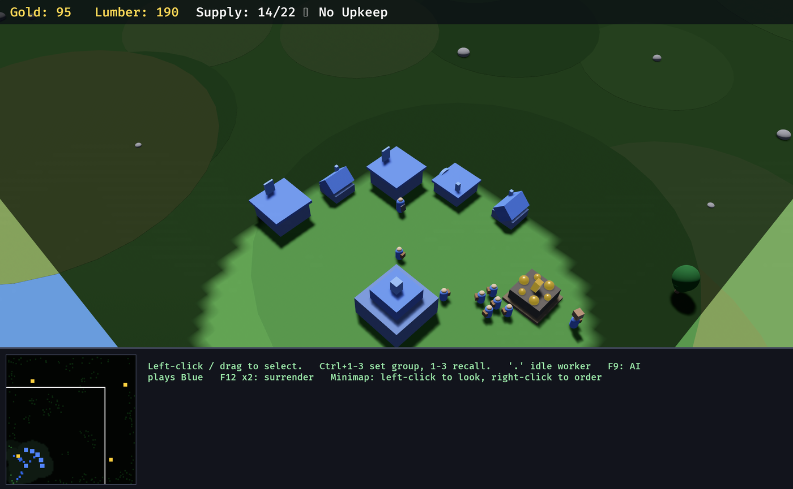

# Fog of War

*One rule of knowability: computed once, rendered twice.*

This is the third of the asymmetries named in [THESIS.md](../THESIS.md). Tempo was
answered by the doctrine layer; interface by the shared vocabulary; information was
answered halfway — the event feed became a shared artifact, but the *snapshot* still
handed a commander the whole board while the player at the keyboard got one screenful,
and the scripted AI read enemy positions straight out of the ECS.

Three different notions of "what is knowable" for one game. This document describes the
one that replaced them.

*The player's renderer, early in a match: a lit disc of current vision around the base, a
dimmer ring of explored ground, black where nothing has ever been. On the minimap, the
same grid — with gold mines and the camera viewport drawn deliberately above the fog,
because both are public. No enemy is anywhere on screen.*

## The rule

`shared.rs` computes **one `FogGrid` per team** at ~4 Hz and every other module only
*reads* it. There is no second implementation anywhere, and that is the entire design:
a rule with two implementations is two rules, and two rules is an information advantage
for whoever happens to have the better one.

| Consumer | What it does with the grid |
|---|---|
| `bridge.rs` | filters each seat's `state.json` through that seat's team's grid |
| `ui.rs` | paints the same grid as a terrain overlay + minimap fog, and hides the same entities the snapshot omits |
| `ai.rs` | takes every enemy fact through it before planning |
| `doctrine.rs` | Forage targeting and Defend threat response go through it |
| `shared.rs` (event feed) | filters the two event categories that are not own-team knowledge |

Because the snapshot and the screen are filtered by the same array, **snapshot content ==
renderable content** is a property of the code rather than a promise in a comment.

### Three states

Classic two-level fog, on the **`NavGrid`'s own cell geometry** (100×100 cells of 2.0
world units) — fog reuses the nav grid rather than inventing a second one, so "the cell a
unit stands in" means one thing in this codebase.

| State | Meaning | Terrain | Enemy units | Enemy buildings |
|---|---|---|---|---|
| `Unexplored` | never seen by this team | hidden | hidden | hidden |
| `Explored` | seen before, not now | remembered | **hidden** | remembered as ghosts |
| `Visible` | in sight of a living unit or building, right now | shown | shown | shown live |

Units are deliberately **not** remembered. An army is not furniture; a remembered army is
a lie that gets people killed, and a commander acting on a stale unit position has been
deceived by its own interface. Buildings are remembered because they do not move.

### Vision is radial, and terrain does not block it

The game has no elevation model — the `crossings` canyon is a nav barrier, not a cliff —
so a line-of-sight pass would cost more than the whole rest of the fog system for a
fidelity nobody can act on. Both teams get the same simple rule.

Every fog query is **XZ only**, so altitude never changes what a unit sees. A flyer
lights exactly the cells it would light standing on them.

## Vision radii

Sight lives in the stat tables next to everything else, is **exported in the catalog**
(`units[].vision`, `buildings[].vision`), and is therefore discoverable by both players
the same way — the human reads it off the build menu's data, a commander reads it out of
`catalog.json`.

Vision is deliberately independent of attack `range`: what a unit can shoot and what it
can find are different questions, and the gap between them is where scouting lives.

| Unit | Vision | Attack range | Note |
|---|---:|---:|---|
| Worker | 12 | 1.8 | not a scout |
| Footman | 16 | 2.0 | the baseline |
| Archer | 18 | 14 | sees a little past its own reach |
| Spearman | 18 | 2.6 | a picket must see the riders coming — but still short of the Raider's 24, so cavalry keeps the initiative |
| Catapult | 14 | 20 | **sees less than it shoots** — siege needs spotters |
| Raider | 24 | 2.2 | **the scout**: sees far, can barely hit anything |
| Knight | 20 | 2.4 | shock cavalry closing at 9.5 has to see the shape it is about to hit — so it out-sees the 18 of the spear picket that counters it, but stays short of the Raider's 24: the hammer, not the scout |
| **Gryphon Rider** | **26** | 6 | **the widest eye in the game**, equal to a TownHall's — altitude is an observation post, fog is XZ only, so height costs a flyer nothing and buys it reach. A hall's worth of vision that *moves*, and Castle-gated because sight this good has to arrive late |
| Hero (Champion) | 20 | 2.4 | leaders see |
| Priestess | 18 | 10 | |

| Building | Vision | Note |
|---|---:|---|
| **Castle** | **34** | top of the ladder: the hall alone watches the approach a Tower would |
| **Keep** | **30** | |
| TownHall | 26 | a base is a team's permanent eyes |
| Tower | 20 | exceeds its 16 attack range — never shoots at what the team cannot see |
| Barracks | 18 | |
| Workshop | 16 | |
| Shop | 14 | |
| Farm | 12 | |
| Wall | 8 | |

Vision climbs the **TownHall → Keep → Castle** ladder for the same reason HP does: what an
upgrade buys is a taller fortification, so each rung watches a little further over its own
ground. It is a real if modest reward, and it is asserted monotonic by
`upgrade_only_kinds_are_never_placeable_and_never_shrink_the_building` alongside the
existing hp/size/supply invariants — a tier-up must never *narrow* what a hall sees, or
teching up would blind you in your own base and the fog would punish the reward.

Nothing in the fog code special-cases `BuildingKind::TownHall`; radius comes from the
per-kind table, so `is_hall` never needed to appear here and a fourth rung would work with
no edit. `Building.kind` mutates in place when a hall tiers up, and vision is read from the
live kind every tick rather than cached at spawn, so the new radius applies the moment the
conversion lands. Buildings mid-`Upgrading` are seen, hidden and remembered like any
other: they keep `Building`/`Team`/`Transform`, and only their `scale.y` is animated.

Buildings provide vision **while under construction** too: a builder standing on a
foundation is looking around.

Two of these numbers are load-bearing balance choices rather than flavour. The Catapult
seeing less than it shoots makes an unescorted siege line genuinely blind, which is what
gives its escorts a job beyond soaking damage. The Raider's 24 makes cavalry the cheapest
answer to "where are they?", which is a role it did not previously have.

## Memory model

Per team, the grid keeps a record of **every enemy structure ever observed**, refreshed
every tick it is in sight — which is what makes the memory current the moment sight is
lost. A record holds `kind`, `pos`, `hp`, `max_hp`, `done` and `last_seen` (game time).

A ghost is forgotten **only when the team can see that the thing is gone**. Walk back onto
the rubble and the memory clears; stay away and you go on believing the barracks is still
standing. That is precisely the mistake fog of war exists to let you make — a ghost can be
stale, and it is the correct amount of wrong.

A ghost is **honestly stale about tier, too**. A scouted TownHall that upgrades to a Keep
with nobody watching keeps reporting *TownHall* — the rung the scout actually saw, not the
one it has no way to know about — and `buildings[].tier` on that record is derived from the
remembered kind. Every rung shares an 8.0 footprint, so a ghost drawn from the stale kind
is still the right size on screen. `upgrading` is never set on a ghost: a conversion is a
live thing, and a stale progress bar would be invented intelligence rather than preserved
intelligence. Covered by `a_hall_that_tiers_up_behind_the_fog_keeps_its_stale_ghost`.

`FogGrid::ghosts()` yields only records whose cell is **not currently visible**. The
backing map holds everything ever seen, including things visible right now; without that
filter every renderer would draw a scouted base twice — once live, once as its own ghost.
"Ghost" means *memory standing in for sight*, so sight wins.

## What stays omniscient, and why

Fog models a commander's **attention**, not a unit's senses.

> The line is: *where a unit is sent* obeys fog; *what a unit does when something arrives
> in front of it* does not.

Gating the second kind would produce soldiers who stand still while being stabbed because
headquarters had not noticed yet.

**Engine-diegetic, deliberately NOT fog-gated** (all in `combat.rs`):

- target acquisition / aggro radius (`acquire_targets`)
- tower acquisition (`tower_acquire`)
- retaliation when damaged
- the `LeashPolicy` anchor check inside acquisition
- `doctrine.rs::auto_cast_abilities` — the caster's own eyes; a hero's 20 vision far
  exceeds the 7-unit Slam radius, so gating it would change nothing except add a lie
  about where the rule lives

**Map geography is public, and always was.** The `map` block (layout, summary,
chokepoints), gold mine positions *and their remaining gold*, and `trees_near` ship
unfiltered to both seats; `ui.rs` paints mines and the terrain barrier above the minimap's
fog layer for the same reason. Fog hides what the opponent is *doing*, not where the map's
furniture sits.

Mine `remaining` is the one deliberate concession and deserves naming as such: it is the
shared clock the whole economy is timed against (expansion windows, "mines run dry" from
the design principles), both `plan_expansion` and a human budget against it, and scouting
reveals it anyway. Hiding it would buy a little intel and cost the design principle it
serves.

**Scripted-AI remainder.** The conversion of `ai.rs` is complete for enemy state — all
four enemy buffers (`enemy_any`, `enemy_ground`, `enemy_combat`, `enemy_buildings`) now
flow through the team's grid, which covers threat assessment, worker flight, Slam timing,
wave target picking and the expansion danger checks. What remains omniscient there is
non-enemy information only: neutral `ResourceNode`s (public geography, above) and the
AI's own state. **There is no known omniscient enemy read left in `ai.rs`.**

## Consequences worth knowing

**Bounty caches are now vision-gated.** A cache is treasure on open ground, not geography,
and open ground nobody is looking at tells you nothing. This is a real gameplay change:
the `Forage` posture now chases only what its team can currently see, so Forage has become
a posture for an army already out on the map rather than a map-wide treasure radar. A
squad that can see no cache falls back to mustering (the existing Forage→Defend rewrite).

**The event feed was audited category by category.** Own losses, own buildings, own hero,
own squad wipes are own-team knowledge by construction and need no gate. Two categories
did leak:

- **"hostiles near base"** — `THREAT_RADIUS` is 45 world units, which is *wider than any
  vision radius in the table*. The tempting assumption that anything near your own base
  is inside your own vision by definition is false, and unfiltered this event was a free
  early-warning radar ringing the entire approach to your base. It now reports the
  hostiles you can actually see.
- **bounty spawn/disappearance** — announced only when the cache enters your vision, and
  "gone" only when you are watching the spot it vanished from. Leaving your vision is
  explicitly *not* a disappearance: the memo is a team's belief about the map, so a cache
  that walks out of sight stays believed-in, and one that expires unseen is dropped
  silently rather than reported as news you did not witness.

**Attack orders are gated both ways.** A `state.json` that will not show you an enemy must
not accept an `attack` command against it either, or the filtering is decoration.
`bridge.rs` rejects attack targets that are neither visible nor a remembered structure
(`target N is not visible`); `ui.rs` applies the identical gate to right-click targeting
and to the hover ring — a hover highlight over an invisible enemy would be a perfect
enemy detector, sweep the cursor across the fog and watch the crosshair light up.

**The scripted AI needed a minimal explore behaviour.** Before fog, "attack the enemy
base" could never be wrong because the enemy base was always in the snapshot. Now an
opponent that loses its main and survives on an unscouted expansion is genuinely lost, and
an army that only ever walks to a place it has already confirmed is empty would never find
it — the match would run to the time cap with both sides intact. `wave_objective` picks,
in order:

1. the nearest **known** enemy structure (visible now, or remembered from a dead scout);
2. failing that, the opponent's **starting base**, as long as it has never been looked at
   — the one enemy position every player is born knowing, and walking there is both an
   attack and a scouting run;
3. failing that, the **nearest never-seen walkable cell**.

Clause 3 is what keeps the win condition reachable. It is not clever and is not meant to
be.

## Snapshot changes (`bridge.rs`)

| Field | Change |
|---|---|
| `units[]` | enemies only while **currently visible**; never remembered |
| `buildings[]` | enemies live while visible; otherwise appended as **remembered ghosts** |
| `buildings[].last_seen` | **new**, optional. Present *only* on ghosts — game time of the observation. Its presence is exactly the "this is memory, not observation" flag. Ghosts carry empty `queue`/`progress` and no `ability_cd`: a production queue is a live thing, and remembering one would be inventing intelligence rather than preserving it |
| `bounties[]` | only while visible — the two seats' lists now legitimately differ |
| `fog` | **new** object: `{enabled, explored, visible}`. Read it before concluding anything from an empty `units` array — "I have no information" and "there is nothing there" are otherwise the same empty list |
| `mines[]`, `trees_near`, `map` | **unchanged** — public geography |
| `me`, `squads`, `unlocked`, `events` | **unchanged** — own-team by construction |
| commands | `attack` against a target that is neither visible nor remembered is rejected |

`catalog.json` gains `vision` on every unit and building.

## The escape hatch

`WC3_FOG=0` restores the pre-v2 omniscient baseline: every cell permanently `Visible`, no
memory, nothing filtered anywhere. It exists so old AARs and balance tooling have
something to compare against — **not as a gameplay option**. Default is on.

It is implemented as a *fully lit grid* rather than a flag checked at every call site, so
every reader works unchanged against it and the disabled path cannot drift from the
enabled one. The one place the flag itself is consulted is `ui.rs`, which takes the
overlay off the screen entirely rather than painting a transparent one every frame.

The mode is logged once at startup (`fog of war: ON (WC3_FOG=0 to disable)`) so a log or
an after-action report always says which rules it was played under.

## Rendering notes and known limitations

The overlay is a **single quad** lying on the ground plane at `y = 0.16`, textured with a
100×100 image built straight from the grid — one texel per nav cell, linearly filtered so
the boundary is soft rather than a staircase. The **same image handle** is mounted on the
minimap as an `ImageNode` (with `flip_y`, since the minimap draws +Z upward while the
texture stores it downward), which is why the two views cannot drift apart.

Consequences of it being a flat quad rather than a shader:

- **Tall scenery would poke through it.** A forest in never-visited terrain would stand
  fully lit above a black floor. Tree clusters are therefore hidden outright until their
  ground is *explored* (not *visible* — terrain is remembered). Gold mines are exempt as
  public geography. Small ground doodads (rocks) still poke through; they carry no
  information and are left alone.
- **Enemy entities are hidden, not dimmed.** `Visibility::Hidden` on the root removes the
  whole entity, health bars included, since bars are children of their owner. This is the
  correct behaviour anyway — a dimmed enemy is still an enemy you can see.
- The overlay is removed from the screen entirely under `WC3_FOG=0` rather than painted
  transparent every frame.

A proper fog *shader* (sampling the same texture in the terrain material, or a
post-process) would remove the tall-scenery caveat and is the obvious next step if fog
rendering is ever revisited. It would not change the rule — only who draws it.

## Cadence and ordering

Recompute is **0.25 game-seconds (~4 Hz)** — deliberately *game* time, unlike the event
feed's real-time cadence. The feed keeps a watcher current and a watcher's attention runs
at one second per second; fog is a gameplay input that `ai.rs` and `doctrine.rs` both
read, so a `WC3_SPEED=16` run must resolve the same number of fog updates per game-second
as a 1× run or the two are not the same match.

`update_fog` runs in the `FogSet` system set, after `apply_death` (the dead stop seeing on
the tick they die). Every consumer plugin declares `.after(FogSet)`, so no reader can see
last tick's grid on the frame it flips.

This is attention, not collision: 4 Hz is a generous budget for a decision layer that
already thinks at 1 Hz.
